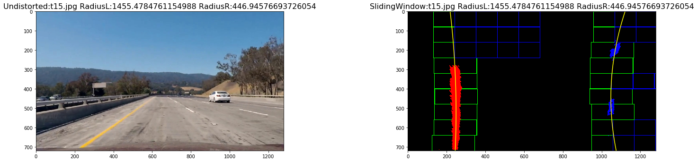

# **Advanced Lane Finding**

The goals of this project are the following:
* Compute the camera calibration matrix and distortion coefficients given a set of chessboard images.
* Apply a distortion correction to raw images.
* Use color transforms, gradients, etc., to create a thresholded binary image.
* Apply a perspective transform to rectify binary image ("birds-eye view").
* Detect lane pixels and fit to find the lane boundary.
* Determine the curvature of the lane and vehicle position with respect to center.
* Warp the detected lane boundaries back onto the original image.
* Output visual display of the lane boundaries and numerical estimation of lane curvature and vehicle position.

# **Camera Calibration**
The code for this step is contained in the first few cell of the IPython notebook located in [AdvancedLaneFinding](./CarNDAdvancedLaneFindingV6.ipynb).

The very 1st step is to prepare "object points", which will be the (x, y, z) coordinates of the chessboard corners in the real world. The basic assumption is that the chessboard is fixed on the (x, y) plane at z=0 and all object points are same every image. Imagge points will be appended with the (x, y) pixel position of each of the corners in the image plane with each successful chessboard detection.

Finally, use the output objpoints and imgpoints to compute the camera calibration and distortion coefficients using the cv2.calibrateCamera() function. I applied this distortion correction to the test image using the cv2.undistort() function and obtained this result:

# **1. Pipeline (Images)**
### **Gradients and color transformations**
A combination of color and gradient thresholds is used to generate a binary image.

### **Color channel selection**
I converted the image to HLS color space in addition to RBG to detect lane under diffrent light condition like shadows, missing markings,miss alignment and if the road top is not blacktop.

### **Color and Thresholding**
Gradient and color transformation are achived by taken sobel x i.e derivative in x and then thresholding the image to convert it into a binary image.
sxbinary[(scaled_sobel >= thresh_min) & (scaled_sobel <= thresh_max)] = 1

### **Perspective Transformation**
Perspective transform is done using cv2.warpPerspective transform function. The function takes as inputs an image (img), as well as source (src_points) and destination (dst_points) points along with the camera tranformation matrix. I chose the hardcode the source and destination points in the following manner:

	src_points=np.float32([[585,455],[702,455],[1200,720],[160,720]]) #by trial and error method
	offset = 200 # offset for dst points
	#Grab the image shape
	img_size = (gray.shape[1], gray.shape[0])
	dst_points = np.float32([[offset, 0],
											 [img_size[0]-offset, 0],
											 [img_size[0]-offset, img_size[1]],
											 [offset, img_size[1]]])
                     

**Merging all:**

                 
### **Region of Interest**
With trial and error method four points where identified to mark the lanes. 

### **Finding Lane Lines and Radius of Curvature**
Additionally, a horizontal sliding window approach is used to find lane in case of sharp turns.

#trying horizontal sliding window to find the minimum pixcels as the lane may be curving...

	
  	for i in range(0,3,1):
			win_xleft_low =  win_xleft_high-margin
			win_xleft_high = win_xleft_high+margin
			cv2.rectangle(out_img,(win_xleft_low,win_y_low),(win_xleft_high,win_y_high),(0,0,255), 2)
			good_left_inds = ((nonzeroy >= win_y_low) & (nonzeroy < win_y_high) &(nonzerox >= win_xleft_low)
										&  (nonzerox < win_xleft_high)).nonzero()[0]
			left_lane_inds.append(good_left_inds)
			if len(good_left_inds) > minpix:
					leftx_current = np.int(np.mean(nonzerox[good_left_inds]))
					break
	
                    

### **Final Image**

# **2.Pipeline (video)**
A line class is defined to keep track of last detections of the lane lines and radius so that we can use that to check new detections.

[Final Video](https://www.youtube.com/watch?v=d1_lqcpHaao)

# **Future improvements:**
1. The current approach will fail if the lanes have extreme turns or there are no lane markings.
2. Implement smoothing and use of last good known markings.
