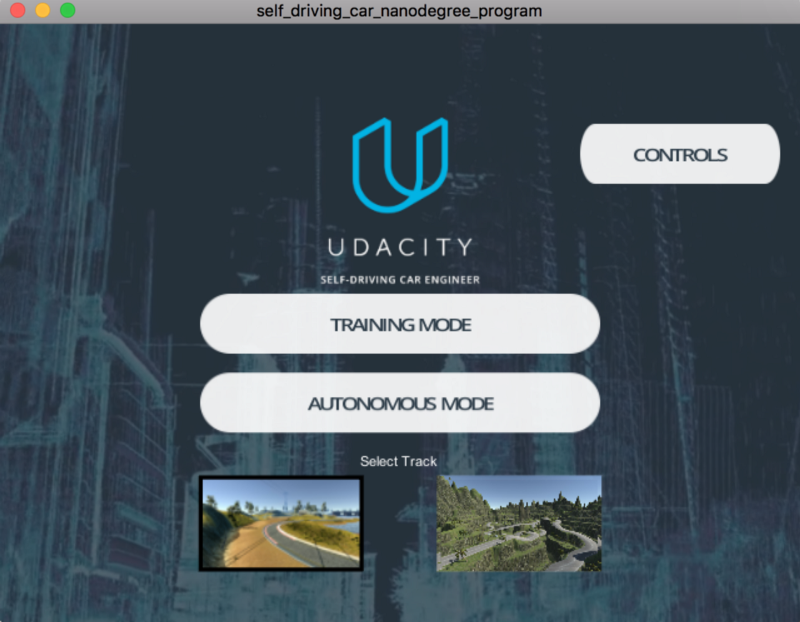
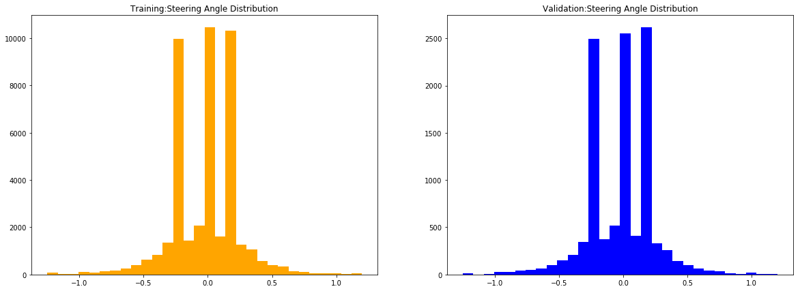
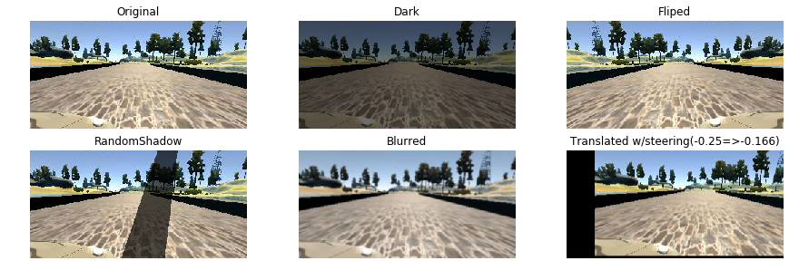
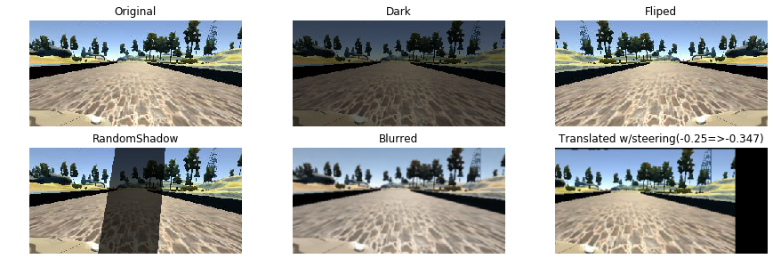
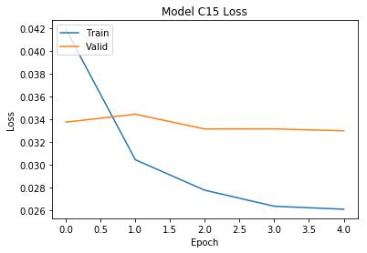

# **Behavioral Cloning** 

## **Behavioral Cloning Project**
The goals / steps of this project are the following:
* Use the simulator to collect data of good driving behavior
* Build, a convolution neural network in Keras that predicts steering angles from images
* Train and validate the model with a training and validation set
* Test that the model successfully drives around track one without leaving the road
* Summarize the results with a written report

## **Simulator Data Collection**
I collected the data (images) by driving the car in the Udacity simulator in training mode.The simulator environment provides two options: Training mode and Autonomous mode. 

1. Training Mode: The simulator will load where we can drive the car similar to video game.
2. Autonomous Mode: The autonomous mode is used to run the CNN trained model.

The input dataset comprised of 55032 images which is created by combining the following four different datasets:  
1. Manually created dataset by driving the car in the center of the track in the clockwise direction 
2. Manually created dataset by driving the car close to the left edge of the track in the counterclockwise direction 
3. Manually created dataset by driving the car close to the right edge of the track in the clockwise direction  
4. Dataset provided by Udacity

In order to make the model unbiased, the car was driven towards the edge of right and left the sides of the lane in  clockwise and counterclockwise respectively in addition to driving at the center of the lane.

## **Data**
- The size of the training set is: 44025(80%),  height:160, width:320, channels:3 
- The size of the validation set is:11007(20%), height:160, width:320, channels:3 
- The number of classes/labels in the data set is: 1 class (Steering Angle)
### **Observation**
While investigating this large dataset, I noticed some factors which I thought, could cause confusion and affect the training of the model. 

It is observed that the car has a tendency to drive straight which means there is a very little deviation in the steering angles. 
Besides, as there are shadows and darker images due to various reasons on the track, training the model without taking these into account, may produce erroneous model. 
As we know, a good model requires the car to steer correctly irrespective of the sides and turns and to identify the objects to drive safely. To address these, I applied Augmentation techniques on the dataset. The steps are discussed in the following paragraphs.

### **Augmentation**
* Camera Angle correction:
To start with the Augmentation process, I first considered the correction of left and right camera angles.To do this, I followed an empirical approach and set the left and right camera angle correction value as 0.15 and 0.2 respectively.

* Horizontal Flip:
Horizontal flipping takes care the left turn bias which involves flipping images and taking the opposite sign of the steering measurement.

      return np.fliplr(_image)
      _originalSteeringAngle = -1. *_originalSteeringAngle
      
* Darker Image & Shadow: I noticed that the track1 has diffrent brightness and shadows in different areas while collecting the data. In order to train model for such conditions, a random value was applied to multiply the RGB channels to make the image darker and a randon shadow was added to the image.

      #brightness
          _darkFactor = np.random.uniform(_lowValue, _highValue)    
          _image[:,:,2] = _image[:,:,2]*_darkFactor
    
      #shadow
         cols, rows = (_image.shape[0], _image.shape[1])    
        _topLeft = np.random.uniform(_lowValue, _highValue) * _image.shape[1]
        _bottomLeft = np.random.uniform(_lowValue, _highValue) * _image.shape[1]    
        if np.random.random_sample() <= 0.6:
            _bottomRight = _bottomLeft - np.random.uniform() *(rows-_bottomLeft)
            _topRight = _topLeft - np.random.uniform() *(rows-_topLeft)
        else:        
            _bottomRight = _bottomLeft + np.random.uniform() *(rows-_bottomLeft)
            _topRight = _topLeft + np.random.uniform() *(rows-_topLeft) 
        _poly = np.asarray([[[_topLeft,0],[_bottomLeft, cols],[_bottomRight, cols],
                             [_topRight,0]]], dtype=np.int32)       
        ...
        return cv2.addWeighted(_image.astype(np.int32), _alphaWeight, _srcImageCopy,
                              _weightFactor, 0).astype(np.uint8)
    
* Blurred: We used the smallest size and the fastest graphical quality for capturing data. A gaussian filter was used to blurr the image to train the model in this case.

      def _blurred(_image,_alpha=0.6):
          return ndimage.gaussian_filter(_image, _alpha)
* Translation: In order to remove streering angle bias 0.0(driving stright) I used openCV function to translate image pixcels and adjusted streeing angle to sync with the translation. After few permutaions, a adjustment of 0.002 was used as the steering angle adjustment per pixel.

      _newSteeringAngle = _originalSteeringAngle +( _transX * _steeringAngleShift)
      _transMatrix = np.float32([[1, 0, _transX],[0, 1, _transY]])
      _image = cv2.warpAffine(_image, _transMatrix, (_width,_height))

Final Output:

### **Model Architecture**

After experimenting with LeNet and NVIDIA, I chose NVIDIA architecture as it has better 'mse' and faster reaction time in GPU. I have used NVIDIA https://arxiv.org/pdf/1704.07911.pdf and https://arxiv.org/pdf/1604.07316v1.pdf as a reference for coming up with the baseline model.The data is cropped and normalized in the model using a Keras lambda layer. 

Final model:
01. Image Cropping to remove Sky and Car dashboard
02. Image normalization,input_shape=(80,320,3)
03. Convolution: filter: 24, Kernel:5x5, strides: 2x2, activation: ELU
04. Convolution: filter: 36, Kernel:5x5, strides: 2x2, activation: ELU
05. Convolution: filter: 48, Kernel:5x5, strides: 2x2, activation: ELU
06. Convolution: filter: 64, Kernel:3x3, activation: ELU #non-strided convolution
07. Convolution: filter: 64, Kernel:3x3, activation: ELU #non-strided convolution
08. Flattened Layer
09. Fully connected: neurons: 100, activation: ELU
10. Fully connected: neurons: 50, activation: ELU
11. Fully connected: neurons: 10, activation: ELU
12. Fully connected: neurons: 1 (output)

### **Model Training**

Model training was iterative and as I used a well known architecture created by NVIDIA(https://arxiv.org/pdf/1604.07316v1.pdf), the validation loss was below 3% . I changed hyper parameters to make sure that the model is generalized for testing. All adjustments on model architecture was due to overfitting i.e. a 'low mse' on the training and validation set but 'high error' on simulator autonomous mode driving. Addition of Keras lambda layer for normalization, cropping and image augmentation to cover random shadow, blurrness, steering angle bias collecting data to cover center lane driving, recovering from the left and right sides of the road helped to generalize the model. 

The final data pipeline hyper parameters are:

            'Paths': [   #data file paths
                        "['./mydata/',0]",#Counter clockwise center
                        "['./data/',1]", #Udacity
                        "['./dataturnC/',0]",#recovery clockwise
                        "['./dataturnR/',0]" #recovery counter clockwise
                     ],
                'CameraAngles':['center','left','right'],
                'SteeringCorrection':['0.15L','0.25R'],
                'BatchSize':'50',
                'SteeringAngleShift':'0.002',
                'AugmentationProbability':'0.6',

I also implemented model checkpoints:

            #model checkpoint
            _checkpoint = ModelCheckpoint(filepath='modelcheckpoint.h5', monitor='val_loss',save_best_only=True)
            _stopper = EarlyStopping(monitor='val_acc', min_delta=0.0003, patience=5)

Metrics:

### **Finally, the model was tested by running it through the simulator and ensuring that the vehicle could stay on the track.**
[Drive](https://youtu.be/AzziE1QRoAo)

# **Future Improvements**
The current model is adopted to clone my driving behavior which can be biased based on my style( drive close to curve while turning). I would like to create more data/images to make a generalized model capable of handling real world scenarios like diffrent view angles, weather etc. 

It would be nice to test and extend NVIDIA models to add Keras lambda layer to change incoming image color space to remove variations. It would be also interesting to create complementary models to train and cross-train diffrent driving behaviors. 

#### ** Challenge ** 
The main challenge for a self driving car is to handle real world conditions like optical illusions/mirage or mirror mounted on a back of car.
