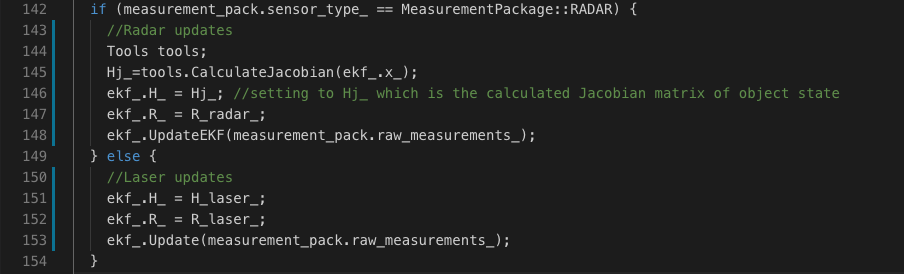

# Extended Kalman Filter Project

The goal of the project is to estimate the state of a moving object of interest with noisy lidar and radar measurements utilising the Kalman filter. 

# Prerequisites
1. [uWebSocketIO](https://github.com/uWebSockets/uWebSockets) Git repository includes two files that can be used to set up and install for either Linux or Mac systems.
2. cmake >= 3.5
  * All OSes: [click here for installation instructions](https://cmake.org/install/)
3. make >= 4.1 (Linux, Mac), 3.81 (Windows)
  * Linux: make is installed by default on most Linux distros
  * Mac: [install Xcode command line tools to get make](https://developer.apple.com/xcode/features/)
  * Windows: [Click here for installation instructions](http://gnuwin32.sourceforge.net/packages/make.htm)
4. gcc/g++ >= 5.4
  * Linux: gcc / g++ is installed by default on most Linux distros
  * Mac: same deal as make - [install Xcode command line tools](https://developer.apple.com/xcode/features/)
  * Windows: recommend using [MinGW](http://www.mingw.org/)

Once the installation for Prerequisites is complete, the main program can be built and run by following the below steps.
#### Basic Build Instructions
1. Clone this repo.
2. Make a build directory: `mkdir build && cd build`
3. Compile: `cmake .. && make` 
   * On windows, you may need to run: `cmake .. -G "Unix Makefiles" && make`
4. Run it: `./ExtendedKF 

# Input
Values provided by the simulator to the c++ program 
["sensor_measurement"] => the measurement that the simulator observed (either lidar or radar)

# Output
values provided by the c++ program to the simulator

* ["estimate_x"] <= kalman filter estimated position x
* ["estimate_y"] <= kalman filter estimated position y
* ["rmse_x"]
* ["rmse_y"]
* ["rmse_vx"]
* ["rmse_vy"]

## Code Style
This project sticks to [Google's C++ style guide](https://google.github.io/styleguide/cppguide.html).

---
# Execution of Kalman Filter
To start with, change the working directory to 'build'. To run the Extended Kalman filter, ./ExtendedKF should be executed. 
If everything works fine then the otput should be as follows and the simulator gets connected to the program instantly:

We have two datasets in the simulator namely Dataset1 and Dataset2. The difference between them are:
The direction the car (the object) is moving.
The order the first measurement is sent to the EKF. On dataset 1, the LIDAR measurement is sent first. On the dataset 2, the RADAR measurement is sent first.
Here is the simulator final state after running the EKL with dataset 1:

---

