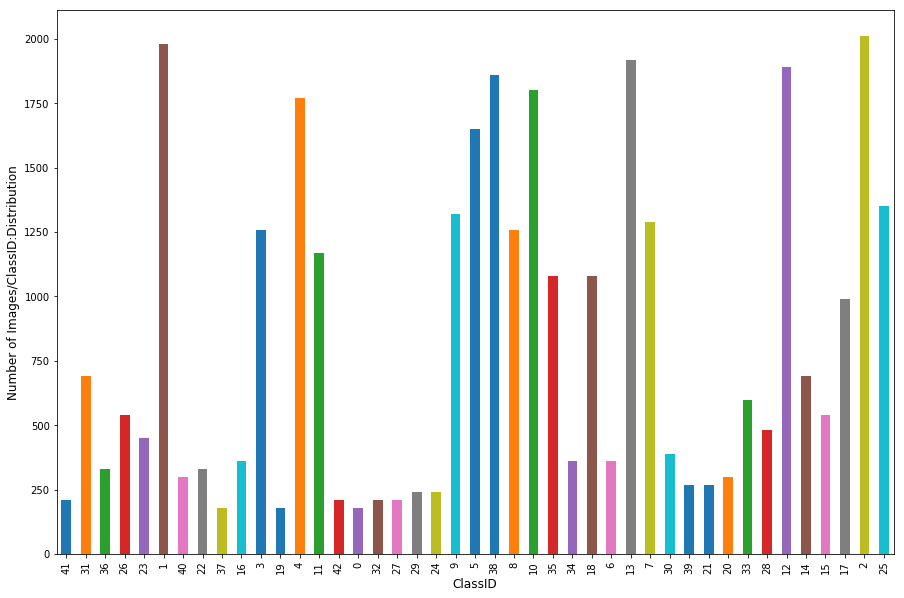

# **Traffic Sign Recognition**

## **Project Goal**
The goals of this project are the following:
* Load the traffic dataset
* Explore, summarize and visualize the data set
* Design, train and test a CNN model architecture
* Using the model to make predictions on new images downloaded from web
* Analyze the prediction(softmax) probabilities of the new images
* Future improvements - point of view

# **1. Pipeline - Traffic Images**
Pandas library is used to calculate summary statistics of the traffic signs dataset. Trainig features are a 4D array(number of  examples, width of an image, height of an image, color channels) of traffic sign images.

* The size of training set is: **34799,width:32, height:32, channels:3** 
* The size of validation set is:**4410**
* The size of test set is:**12630**
* The shape of a traffic sign image is:**Width of 32,a Height:32 and color channels:3(RBG)**
* The number of unique classes/labels in the data set is: **43 classes**

# **Observations**
1. The train data set is orderly packed.
2. The mapping between Class ID and Traffic Sign name are present in saperate file called "signname.csv".
3. Images are smaller in size and mostly front view.
4. Class distribution is not even - with few outliers like Class ID 1(Speed limit (20km/h),2(Speed limit (50km/h) and 13(Yield) followed by 12(Priority Road) abd 38(Keep right).

### **Eyeballing Images**

### **Class Distribution**

