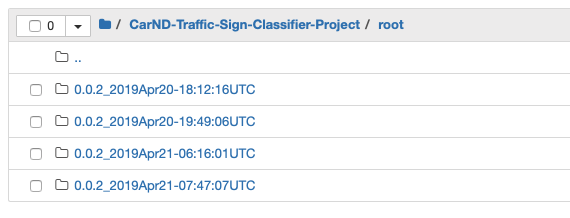
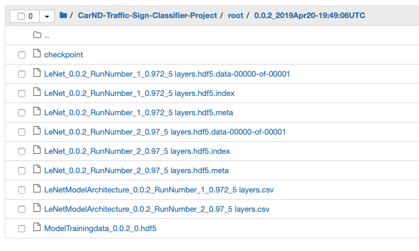
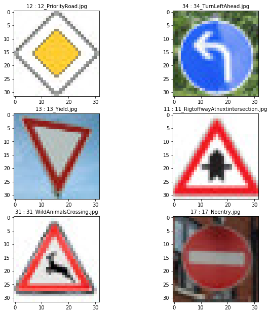

# **Traffic Sign Recognition**

## **Project Goal**
The goals of this project are the following:
* Load the traffic dataset
* Explore, summarize and visualize the data set
* Design, train and test a CNN model architecture
* Using the model to make predictions on new images downloaded from web
* Analyze the prediction(softmax) probabilities of the new images
* Future improvements - point of view

# **1. Pipeline - Traffic Images**
Pandas library is used to calculate summary statistics of the traffic signs dataset. Trainig features are a 4D array(number of  examples, width of an image, height of an image, color channels) of traffic sign images.

* The size of training set is: **34799,width:32, height:32, channels:3** 
* The size of validation set is:**4410**
* The size of test set is:**12630**
* The shape of a traffic sign image is:**Width of 32,a Height:32 and color channels:3(RBG)**
* The number of unique classes/labels in the data set is: **43 classes**

# **Observations**
1. The train data set is orderly packed.
2. The mapping between Class ID and Traffic Sign name are present in saperate file called "signname.csv".
3. Images are smaller in size and mostly front view.
4. Class distribution is not even - with few outliers like Class ID 1(Speed limit (20km/h),2(Speed limit (50km/h) and 13(Yield) followed by 12(Priority Road) abd 38(Keep right).

### **Eyeballing Images**

### **Class Distribution**

# **Design and Test Model Architecture**
### **Pre-processing the dataset(normalization, grayscale and shuffling)**
The image dataset was normalized so that the data has mean zero and equal variance to help us to reduce the error. For image data, I used the below code to approximately normalize the dataset.

    	X_train=(X_train - 128)/ 128 
	
Image was converted to grayscale using this code

	X_train=np.sum(X_train/3, axis=3, keepdims=True)

# **2. Model Architecture**

My final model consisted of the following layers:

| Layer				|Description							| 
|:-----------------------------:|:-------------------------------------------------------------:| 
| Layer1: Convolution		| Input=32x32x1:Output=28x28x6:Filter:5x5:Stride:1x1:VALID	|
| Layer1:RELU			| Activation							|
| Layer1:Max Pooling		| Input=28x28x6:Output=14x14x6:ksize:2x2:Stride:2x2		|
| Layer2:Convolution 		| Input=14x14x6:Output=10x10x16:Filter:5x5:Stride:1x1:VALID	|
| Layer2:MaxPooling		| Input=10x10x16:Output=5x5x16:ksize:2x2:Stride:2x2		|
| Layer2:Flatten		| Input=5x5x16:Output=400					|
| Layer2:Dropout		| Keep Probability:0.5						|
| Layer3:FullyConnected		| Input=400:Output=120						|
| Layer3:RELU			| Activation							|
| Layer3:Dropout		| Keep Probability:0.5						|
| Layer4:FullyConnected		| Input=120:Output=84						|
| Layer4:RELU			| Activation							|
| Layer4:Dropout		| Keep Probability:0.5						|
| Layer5:FullyConnected		| Input=84:Output=43						|

# **3. Model Training**
Model training was iterative as the validation accuracy was below 80% inspite of chosing a well known architecture created by Pierre Sermanet and Yann LeCun (http://yann.lecun.com/exdb/publis/pdf/sermanet-ijcnn-11.pdf). I changed hyper parameters to make sure that model is generalized for testing. All adjustments on model architecture was due to overfitting i.e. a high accuracy on the training set but low accuracy on the validation set. Adition of dropout with slower learning rate helped to generalze the model. The final hyper parameters are:

	_epochs =150
	_batchSize=128
	_dropout= 0.5 #forcing few weights to play dump
	_learningRate = 0.0006 #slower rate 0.001 or 0.002 was resulting in less than 80%
### **Final Results**
	Validation Accuracy = 0.972
	Test Accuracy with Model 2.0 = 0.952
	Test Accuracy with Model 1.0 = 0.944

# **Model Tracking**
I implemented a tracking nomenclature since it was extremely difficult to keep track of model architecture, hyperpram and date & time. This approach helped me quickly organize my model training effort and save time. Please see below:

Details of the model can be tracked:

# **4. Testing model generalizability**
This was done to check model accuracy if subjected to a new image from internet. The model performed well as the images were preprocessed to meet the input needs i.e. 32x32x1 with good amount if luminosity.

The model was able to identify the images correctly. Web sample test accuracy = 1.000

Please see the prediction outputs:

# **5. Top five softmax probabilities for the predictions**
For each of the new images, i used the model's softmax probabilities function to show the certainty of the model's predictions.

	_topCounter=5 #top five softmax probabilities
	_softmaxLogits = tf.nn.softmax(logits)
	_top_k=tf.nn.top_k(_softmaxLogits,_topCounter)

	with tf.Session() as sess:
	    _saver = tf.train.import_meta_graph('./root/0.0.2_2019Apr21-07:47:07UTC/LeNet_0.0.2_RunNumber_2_0.974_5 layers.hdf5.meta')
	    _saver.restore(sess, tf.train.latest_checkpoint('./root/0.0.2_2019Apr21-07:47:07UTC/'))
	    _softmaxProbabilities = sess.run(_top_k, feed_dict={x: X_test_web, keep_prob: 1.0})
	    print(_softmaxProbabilities)
   
##### **Output of tf.nn.top_k(softmax probabilities)**
	Actual ClassID 12==>Predicted Class ID: 12(100%), 40(2.18e-11%), 13(2.41e-15),  9(3.15e-18), 42(2.9e-18)
	Actual ClassID 34==>Predicted Class ID: 34(9.99e-01), 38(2.85e-4), 13(1.1e-8), 35(9.05e-11),  9(8.07e-11)
	Actual ClassID 13==>Predicted Class ID: 13(1.0e+00), 12(1.49e-31), 35(1.37e-34), 15(1.38e-36),0(0.0+00)
	Actual ClassID 11==>Predicted Class ID: 11(9.99e-01), 30(3.34e-06), 27(2.53e-10), 21(1.22e-11),25(9.18e-13)
	Actual ClassID 31==>Predicted Class ID: 31(9.99e-01), 19(4.10e-06),23(2.33e-07),21(2.19e-07),29(1.23e-08)
	Actual ClassID 17==>Predicted Class ID: 17(9.99e-01), 14(4.78e-05),38(8.44e-07),12(6.33e-08),0(8.25e-09)

# **6. Future Improvement**
The main difficulty will be to create label data to make a generalized model capable of handling real world senerio like diffrent view angle, distortion, damaged sign, portioned covered etc. It would nice to extend the project to test with  other known model like Inception V3, VGG 16/19, ResNet50.

